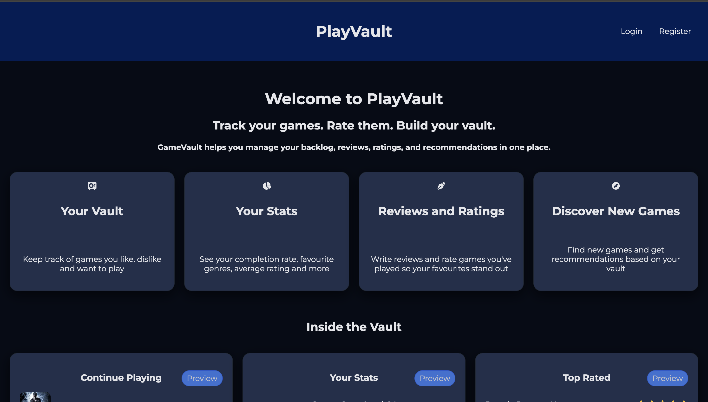
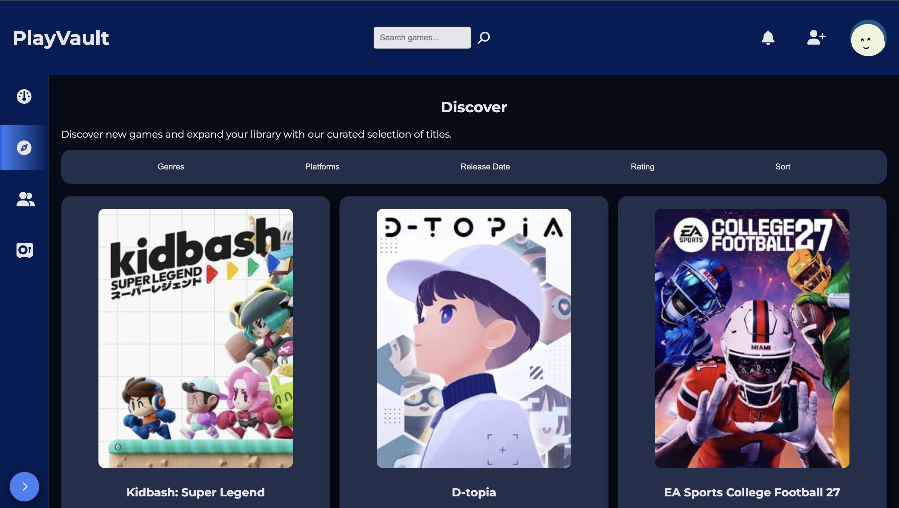
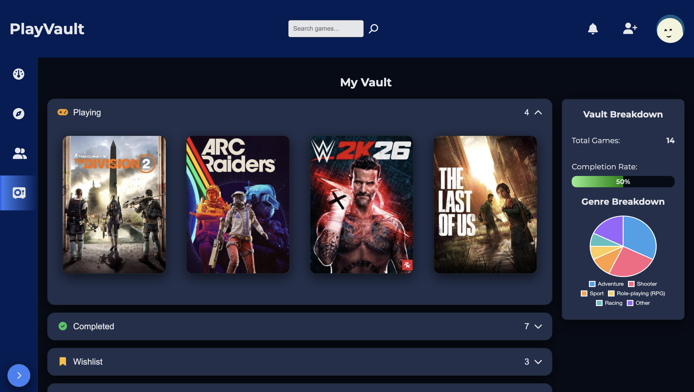
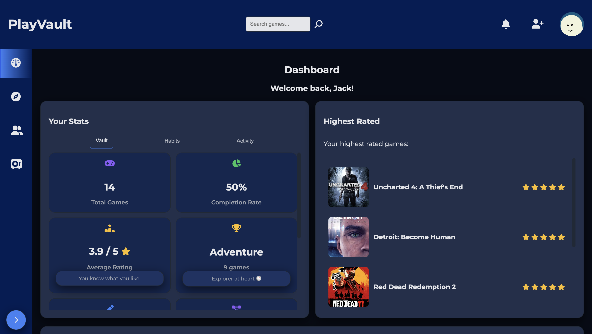

# 🎮 PlayVault

PlayVault is a full-stack web application that allows users to discover, track, and organise their video game library. Inspired by platforms such as Letterboxd, PlayVault enables users to browse games, save them to a personal library, and manage their gaming backlog.

## ✨ Features

- 🔐 User authentication (Register/Login)
- 🎮 Browse thousands of games using the IGDB API
- 🔍 Search and filter games by genre, platform, release date and rating
- 📚 Personal game library
- ⭐ Track game status (Playing, Completed, Wishlist, Dropped)
- 👤 User profile management
- 🚫 Duplicate game prevention
- 📱 Responsive user interface

---

## 🛠️ Built With

### Frontend
- HTML
- CSS
- JavaScript
- EJS

### Backend
- Node.js
- Express.js

### Database
- MongoDB
- Mongoose

### Authentication
- bcrypt
- express-session

### External APIs
- IGDB API
- Twitch OAuth Authentication

---
## 📸 Screenshots

| Home | Discover |
|------|----------|
|  |  |

| Vault | Dashboard |
|---------|-----------|
|  |  |

---

## 🚀 Installation

Clone the repository

```bash
git clone https://github.com/yourusername/playvault.git
```

Navigate into the project

```bash
cd playvault
```

Install dependencies

```bash
npm install
```

Create a `.env` file containing:

```env
MONGODB_URI=your_mongodb_connection
SESSION_SECRET=your_session_secret

TWITCH_CLIENT_ID=your_client_id
TWITCH_CLIENT_SECRET=your_client_secret
```

Start the development server

```bash
npm start
```

---

## 🎯 Future Improvements

- User reviews and ratings
- Friends and social features
- Achievement tracking
- Game recommendations
- Dark mode
- Responsive mobile improvements

---

## 📖 What I Learned

During this project I gained experience with:

- Building full-stack web applications
- RESTful API development
- Session-based authentication
- Working with external APIs (IGDB)
- MongoDB data modelling
- MVC architecture
- Server-side rendering using EJS
- Error handling and validation

---

## 📄 License

This project was created for educational and portfolio purposes.
